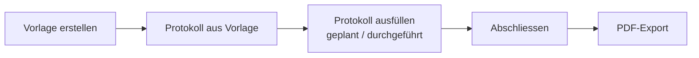

# Übersicht für Vereine

hocX begleitet einen Verein durch den kompletten Zyklus einer Sitzung/Vereinsperiode:

## Kernbereiche

| Bereich | Was damit geht |
|---|---|
| [Zyklen & Vorlagen](vorlagen.md) | Wiederkehrende Struktur einer Sitzungsart definieren (Traktanden, Blöcke, Tabellen) |
| [Protokolle](protokolle.md) | Konkrete Sitzung planen, durchführen, abschliessen, exportieren |
| [Termine](termine.md) | Sitzungstermine und weitere Events verwalten |
| [Mitglieder & Teilnehmer](mitglieder.md) | Wer ist im Verein, wer nimmt an welcher Sitzung teil |
| [Finanzen & Bussen](finanzen.md) | Vereinskonto, Buchungen, Bussenverwaltung |
| [Listen](listen.md) | Frei konfigurierbare Listen (z. B. Vorstand, Inventar) |
| [Todos](todos.md) | Aufgaben aus Protokollen nachverfolgen |
| [Abgabebox](abgabebox.md) | Öffentlicher, anmeldefreier Datei-Upload für Externe |

## Rollen

Der Zugriff innerhalb eines Vereins (Mandant) ist rollenbasiert. Details siehe
[Rollen & Berechtigungen](rollen.md).
