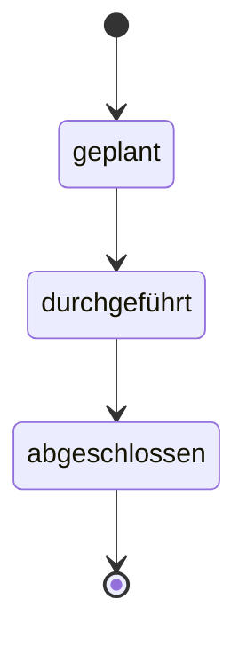

# Protokolle

Ein Protokoll entsteht aus einer Vorlage und durchläuft mehrere Status:

- **geplant** – Vorbereitungsmodus. Struktur-/Auswahldaten (Termine, Listenzeilen,
  Teilnehmer) werden über kleine Icons und dedizierte Popups gepflegt statt direkt
  inline im Text, damit die Vorbereitung übersichtlich bleibt.
- **durchgeführt** – Nachbearbeitungsmodus. Inline-Bearbeitung direkt im Protokolltext
  ist wieder möglich (z. B. während oder nach der Sitzung mitschreiben).
- **abgeschlossen** – Das Protokoll ist ein unveränderlicher Snapshot. Live-Werte (wie
  z. B. "Verantwortlich"-Namen aus einer Liste) werden beim Abschliessen endgültig
  eingefroren. Export als PDF ist möglich.

## Mehrbenutzer-Bearbeitung

Mehrere Personen können gleichzeitig am selben Protokoll arbeiten. Wer gerade welches
Feld bzw. welche Tabellenzelle bearbeitet, wird live angezeigt (Sperre mit Zeitlimit),
damit sich Bearbeitungen nicht gegenseitig überschreiben.

## PDF-Export

Aus einem Protokoll lässt sich jederzeit ein PDF erzeugen (auch vor dem Abschluss). Der
Export liest ausschliesslich die im Protokoll gespeicherten Snapshot-Daten.
