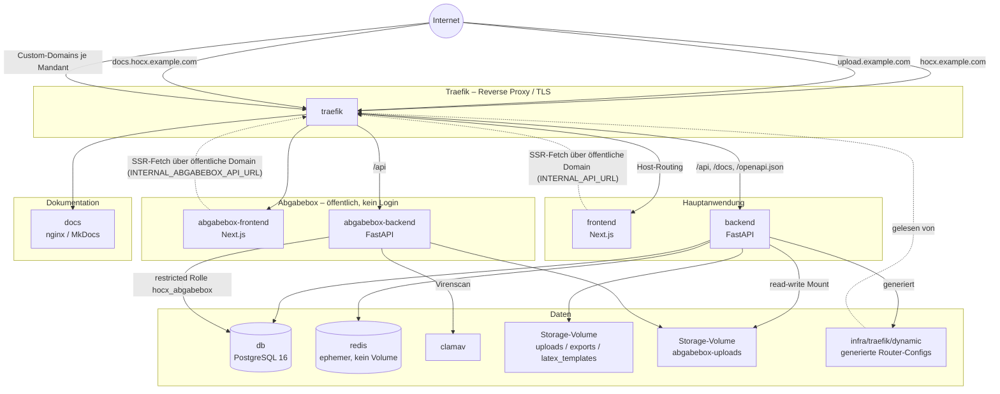

# Big Picture

Diese Seite zeigt den kompletten Stack, so wie er auf dieser Instanz (Dev,
`hocx.example.com`) tatsächlich läuft: alle Container, welche Daten sie halten und wie sie
miteinander sprechen. Auf Test/Prod ist die Struktur identisch — dort laufen dieselben
Services nur aus fertigen GHCR-Images statt aus lokalem Source-Build (siehe
[Deployment](deployment.md)).

## Diagramm

!!! info "Warum Frontend → Backend über die öffentliche Domain läuft, nicht direkt"
    Die gestrichelten Pfeile (Frontend/Abgabebox-Frontend zurück zu Traefik) sind kein
    Zeichen einer Fehlkonfiguration: server-seitige Fetches laufen bewusst über die
    öffentliche Domain statt direkt per Docker-Servicenamen zum Backend-Container.
    Direkte Verbindungen unter echter Nebenläufigkeit haben in diesem Setup nachweislich
    zu gelegentlich falschen Antworten von uvicorn geführt (siehe
    [Bekannte offene Punkte](offene-punkte.md)). Über Traefik ist der Pfad stabil.

## Komponenten im Überblick

| Komponente | Typ | Zweck | Genutzt von | Hält Daten in |
|---|---|---|---|---|
| `traefik` | Reverse Proxy | TLS-Terminierung (Let's Encrypt), Host-basiertes Routing für alle Domains | jeder eingehende Request aus dem Internet | `infra/traefik/letsencrypt` (Zertifikate), liest `infra/traefik/dynamic` |
| `frontend` | Next.js App | Kunden-UI **und** Platform-Admin-Panel (`/admin`) | Endnutzer (Vereine + Betreiber-Admins) | kein eigener State, SSR-Fetches gegen `backend` |
| `backend` | FastAPI | Haupt-API, Business-Logik, PDF-Export, WebSocket-Kollaboration, generiert Traefik-Router für Custom-Domains | `frontend` (SSR + Client via `/api`) | `db` (volle Rolle `hocx`), `redis`, `storage/`, `abgabebox-uploads` (read-write) |
| `db` | PostgreSQL 16 | Zentrale Datenbank für Haupt- **und** Abgabebox-Daten, über getrennte Rollen isoliert | `backend` (volle Rolle), `abgabebox-backend` (restricted Rolle) | Volume `postgres_data`, nur an `127.0.0.1` gebunden |
| `redis` | Redis 7 | Ephemerer State für Live-Kollaboration im Protokoll-Editor (Presence, Zell-/Feldsperren, Pub/Sub) | `backend` (WebSocket-Route `/api/ws/protocols/{id}`) | kein Volume, kein Passwort, nur intern im Compose-Netz erreichbar |
| `abgabebox-frontend` | Next.js App | Öffentliche, anmeldefreie Upload-Oberfläche | externe Personen ohne hocX-Account | kein eigener State, SSR-Fetches gegen `abgabebox-backend` |
| `abgabebox-backend` | FastAPI | Upload-Annahme, Magic-Byte-Prüfung, ClamAV-Anbindung | `abgabebox-frontend` | `db` (restricted Rolle `hocx_abgabebox`), `storage/abgabebox-uploads` |
| `clamav` | ClamAV | Virenscan aller Abgabebox-Uploads | `abgabebox-backend` | Volume `clamav_db` (Signaturdatenbank) |
| `docs` | nginx + MkDocs (statischer Build) | diese Dokumentation | Team + Endnutzer | kein State |

## Domain → Service

| Domain | Zeigt auf | Bemerkung |
|---|---|---|
| `hocx.example.com` | `frontend` (alles) + `backend` (`/api`, `/docs`, `/openapi.json`) | Haupt-UI inkl. `/admin`, dazu die separat rate-limitierten Login-Routen `/api/auth/login` und `/api/admin/auth/login` |
| `upload.example.com` | `abgabebox-frontend` (alles) + `abgabebox-backend` (`/api`) | `/api/public/*` (POST) hat ein eigenes, engeres Rate-Limit gegen Spam |
| `docs.hocx.example.com` | `docs` | diese Seite |
| Custom-Domains einzelner Mandanten (z. B. `hocx.kundendomain.ch`) | `frontend`/`backend` | Router werden vom `backend` zur Laufzeit generiert und landen als Datei in `infra/traefik/dynamic`, die Traefik automatisch einliest |

## Zwei komplett getrennte Auth-/Datenwelten

Das Diagramm zeigt technisch einen gemeinsamen `db`-Container, aber inhaltlich existieren
**drei voneinander unabhängige Zugriffs-/Datenwelten** darin, die bewusst nicht
miteinander verknüpft sind:

1. **Kunden-Login** (`app_user`, Session-Cookie, Secret `AUTH_SECRET`) — tenant-gescopt,
   sieht nie mehr als die eigenen Vereine.
2. **Platform-Admin-Login** (`platform_admin`, eigenes Session-Cookie
   `hocx_admin_session`, eigenes Secret `ADMIN_AUTH_SECRET`) — einzige Stelle mit
   mandantenübergreifender Sicht, siehe [Platform-Admin-Panel](admin-panel.md).
3. **Abgabebox** — läuft komplett ohne Login, greift nur über die restricted
   DB-Rolle `hocx_abgabebox` (REVOKE-ALL-Baseline + Allowlist) auf einen kleinen
   Tabellenausschnitt zu; selbst ein kompletter Kompromiss von
   `abgabebox-backend` gibt keinen Zugriff auf Kunden- oder Admin-Daten.

Details zu den Sicherheitsgrenzen zwischen diesen Welten stehen auf der
[Sicherheits-Seite](sicherheit.md).
